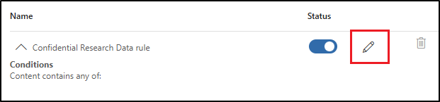

---
lab:
  task: Create and publish a sensitivity label
  exercise: Exercise 2 - Create and publish a sensitivity label
---

# Tareas de aptitudes

La tarea consiste en crear y publicar etiquetas de confidencialidad dentro de la organización, que clasifica y protege los datos confidenciales según su nivel de confidencialidad y los controles de acceso necesarios.

**Tareas:**

1. Habilitación de la compatibilidad con etiquetas de confidencialidad
1. Creación de etiquetas de confidencialidad
1. Publicación de las etiquetas de confidencialidad
1. Configuración del etiquetado automático

## Tarea 1: Habilitación de la compatibilidad con las etiquetas de confidencialidad para archivos en SharePoint y OneDrive

En esta tarea, habilitarás la coautoría para etiquetas de confidencialidad, que también permite etiquetas de confidencialidad para archivos en SharePoint y OneDrive.

1. Abre **Microsoft Edge** y ve a `https://purview.microsoft.com`.

1. En el panel de navegación izquierdo, selecciona **Configuración** > **Information Protection**.

1. En **Configuración de Information Protection**, asegúrate de que estás en la pestaña **Coautoría de archivos con etiquetas de confidencialidad**.

1. Activa la casilla **Activar la coautoría de archivos con etiquetas de confidencialidad**.

1. Selecciona **Aplicar** en la parte inferior de la pantalla.

Has habilitado correctamente la compatibilidad con las etiquetas de confidencialidad para archivos de SharePoint y OneDrive.

## Tarea 2: Creación de etiquetas de confidencialidad.

En esta tarea, el departamento de RR. HH. ha solicitado una etiqueta de confidencialidad para aplicar a los documentos de los empleados de RR. HH. Crearás una etiqueta de confidencialidad para documentos internos y una subetiqueta para el departamento de RR. HH.

1. Abre **Microsoft Edge** y ve a **`https://purview.microsoft.com`**. Inicia sesión en Microsoft Purview como el usuario que seleccionaste como **Administrador de cumplimiento**.

1. En el Portal de Microsoft Purview, selecciona **Soluciones** en la barra lateral izquierda y, después, selecciona **Information Protection**.

1. En la página **Microsoft Information Protection**, en la barra lateral izquierda, y selecciona **Tipos de información confidencial**.

1. En la página **Etiquetas de confidencialidad**, selecciona **+ Crear una etiqueta**.

1. Se iniciará la configuración **Nueva etiqueta de confidencialidad**. En **Proporcionar detalles básicos de esta etiqueta**, escribe:

    - **Nombre**: `Internal`
    - **Nombre para mostrar**: `Internal`
    - **Descripción para los usuarios**: `Internal sensitivity label.`
    - **Descripción para los administradores**: `Internal sensitivity label for Contoso.`

1. Selecciona **Siguiente**.

1. En la página **Definir el ámbito de esta etiqueta**, selecciona **Elementos** y, después, selecciona **Archivos** y **Correos electrónicos**. Si la casilla **Reuniones** está activada, asegúrate de desactivarla.

   > [!NOTE]
   > Cuando **Reuniones** está activado, no se puede crear una subetiqueta para la etiqueta de confidencialidad.

1. Selecciona **Siguiente**.

1. En la página **Elegir la configuración de protección para los elementos etiquetados**, selecciona **Siguiente**.

1. En la página **Etiquetado automático de archivos y correos electrónicos**, selecciona **Siguiente**.

1. En la página **Definir la configuración de protección para grupos y sitios**, selecciona **Siguiente**.

1. En la página **Etiquetado automático para recursos de datos esquematizados (versión preliminar)**, selecciona **Siguiente**.

1. En la página **Revisar la configuración y finalizar**, selecciona **Crear etiqueta**.

1. En la página **Se creó la etiqueta de confidencialidad**, selecciona **No crear una directiva aún** y, a continuación, selecciona **Listo**.

1. En la página **Etiquetas de confidencialidad**, busca la etiqueta de confidencialidad **interna** recién creada. Selecciona los puntos suspensivos verticales (**...**) situados junto a ella y selecciona **+ Crear subetiqueta** en el menú desplegable.

    

1. Se iniciará el Asistente para **Nueva etiqueta de confidencialidad**. En la página **Proporcionar detalles básicos de esta etiqueta**, escribe:

   - **Nombre**: `Employee data (HR)`
   - **Nombre para mostrar**: `Employee data (HR)`
   - **Descripción para los usuarios**: `This HR label is the default label for all specified documents in the HR Department.`
   - **Descripción para los administradores**: `This label was created with input from the Head of HR. Contact the HR department for any changes to the label settings.`

1. Selecciona **Siguiente**.

1. En la página **Definir el ámbito de esta etiqueta**, selecciona **Elementos** y, después, selecciona **Archivos**, **Correos electrónicos** y **Reuniones**.

1. Selecciona **Siguiente**.

1. En la página **Elegir la configuración de protección para los elementos etiquetados**, selecciona la opción **Control de acceso** y, después, selecciona **Siguiente**.

1. En la página **Control de acceso**, selecciona **Configurar configuración de control de acceso**.

1. Configura la configuración de cifrado con estas opciones:

   - **¿Asignar ya permisos o permitir que los usuarios decidan?**: Asignar permisos ahora
   - **Acceso del usuario al contenido expira**: Nunca.
   - **Permitir acceso sin conexión**: Solo durante un número de días
   - **Los usuarios tienen acceso sin conexión al contenido durante estos días**: 15
   - Selecciona el vínculo **Asignar permisos**. En el panel de control flotante **Asignar permisos**, selecciona **+ Agregar cualquier usuario autenticado** y, después, selecciona **Guardar** para aplicar esta configuración.

1. En la página **Control de acceso**, selecciona **Siguiente**.

1. En la página **Etiquetado automático de archivos y correos electrónicos**, selecciona **Siguiente**.

1. En la página **Definir la configuración de protección para grupos y sitios**, selecciona **Siguiente**.

1. En la página **Etiquetado automático para recursos de datos esquematizados (versión preliminar)**, selecciona **Siguiente**.

1. En la página **Revisar la configuración y finalizar**, selecciona **Crear etiqueta**.

1. En la página **Se creó la etiqueta de confidencialidad**, selecciona **No crear una directiva aún** y, a continuación, selecciona **Listo**.

Has creado correctamente una etiqueta de confidencialidad para las directivas internas de las organizaciones y una subetiqueta de confidencialidad para el departamento de recursos humanos (RR. HH.).

## Tarea 3: Publicación de etiquetas de confidencialidad

Ahora publicarás la etiqueta de confidencialidad Interna y de RR. HH. para que las etiquetas de confidencialidad publicadas estén disponibles para que los usuarios de RR. HH. las apliquen a sus documentos de RR. HH.

1. En **Microsoft Edge**, debe estar abierta la pestaña del Portal de Microsoft Purview. Si no es así, ve a **`https://purview.microsoft.com`** > **Soluciones** > **Information Protection** > **Etiquetas de confidencialidad**.

1. En la página **Etiquetas de confidencialidad**, selecciona **Publicar etiquetas**.

1. Se iniciará la configuración de publicar etiquetas de confidencialidad.

1. En la página **Elegir etiquetas de confidencialidad para publicar**, selecciona el vínculo **Elegir etiquetas de confidencialidad para publicar**.

1. En el panel de control flotante **Etiquetas de confidencialidad para publicar**, activa las casillas **Datos internos** y **Datos internos/de empleados (RR. HH.)** y, después, selecciona **Agregar** en la parte inferior del panel de control flotante.

1. Vuelve a la página **Elegir etiquetas de confidencialidad para publicar** y selecciona **Siguiente**.

1. En la página **Asignar unidades de administración**, selecciona **Siguiente**

1. En la página **Publicar en usuarios y grupos**, selecciona **Siguiente**.

1. En la página **Configuración de directivas** selecciona **Siguiente**.

1. En la página **Configuración predeterminada de documentos**, selecciona **Siguiente**.

1. En la página **Configuración predeterminada para correos electrónicos**, selecciona **Siguiente**.

1. En la página **Configuración predeterminada para reuniones y eventos de calendario**, selecciona **Siguiente**.

1. En la página **Configuración predeterminada del contenido de Fabric y Power BI**, selecciona **Siguiente**.

1. En la página **Asignar nombre a la directiva** escribe:

   - **Nombre**: `Internal HR employee data`
   - **Escribir una descripción para la directiva de etiqueta de confidencialidad**: `This HR label is to be applied to internal HR employee data.`

1. Selecciona **Siguiente**.

1. En la página **Revisar y finalizar**, selecciona **Enviar**.

1. En **Nueva directiva creada**, selecciona **Listo** para finalizar la publicación de la directiva de etiquetas.

Has publicado correctamente las etiquetas de confidencialidad internas y de RR. HH. Ten en cuenta que los cambios pueden tardar hasta 24 horas en replicarse en todos los usuarios y servicios.

## Tarea 4: Creación de una directiva de etiquetado automático del lado cliente

En esta tarea, crearás una directiva de etiquetado automático del lado cliente. Las etiquetas automáticas del lado cliente se aplican automáticamente a archivos y correos electrónicos en función de su contenido, lo que garantiza que la información confidencial se clasifique y proteja antes de abandonar el dispositivo del usuario.

1. Todavía debes estar en la página **Etiquetas de confidencialidad** en el Portal de Microsoft Purview. Si no es así, ve a **`https://purview.microsoft.com`** > **Soluciones** > **Information Protection** > **Etiquetas de confidencialidad**.

1. En la página **Etiquetas de confidencialidad**, busca la etiqueta de confidencialidad **interna** recién creada. Selecciona los puntos suspensivos verticales (**...**) situados junto a ella y selecciona **+ Crear subetiqueta** en el menú desplegable.

1. Se iniciará la configuración **Nueva etiqueta de confidencialidad**. En la página **Proporcionar detalles básicos de esta etiqueta**, escribe:

   - **Nombre**: `Confidential Research Data`
   - **Nombre para mostrar**: `Confidential Research Data`
   - **Descripción para los usuarios**: `This document or email contains sensitive research or development data that is proprietary to the organization.`
   - **Descripción para los administradores**: `This label is auto-applied to documents and emails containing information related to research, prototypes, or internal projects.`

1. Selecciona **Siguiente**.

1. En la página **Definir el ámbito de esta etiqueta**, selecciona **Elementos** y, después, selecciona **Archivos**, **Correos electrónicos** y **Reuniones**.

1. Selecciona **Siguiente**.

1. En la página **Elegir configuración de protección para los elementos etiquetados**, selecciona **Aplicar marcado de contenido** y, después, **Siguiente**.

1. Selecciona **Siguiente**.

1. En la página **Marcado de contenido**, selecciona el control de alternancia para habilitar el marcado de contenido.

1. Si la casilla **Agregar un pie de página** está activada, desactívala y activa la casilla **Agregar una marca de agua** y, después, selecciona **Personalizar texto**.

1. En el panel de control flotante **Personalizar marca de agua**, escribe `Confidential - R&D Data` como **Texto de marca de agua**. Aumenta el **tamaño de fuente** a `40` y selecciona **Guardar** en la parte inferior del panel.

1. Vuelve a la página **Marcado de contenido**, si están habilitadas otras opciones de marcado de contenido, deshabilítalas para asegurarte de que **Agregar una marca de agua** sea la única opción habilitada.

1. Selecciona **Siguiente**.

1. En la página **Etiquetado automático de archivos y correos electrónicos**, activa **Etiquetado automático para archivos y correos electrónicos**.

1. En la sección **Detectar contenido que coincida con estas condiciones**, selecciona **+ Agregar condición** > **Contenido incluye**.

1. En la sección **Contenido contiene**, selecciona **Agregar** > **Clasificadores que se pueden entrenar**.

1. En el panel de control flotante **Clasificadores que se pueden entrenar**, agrega estos clasificadores que se pueden entrenar:

   - `Source code`
   - `Project documents`
   - `Software Product Development Files`

1. Selecciona **Agregar** en la parte inferior del panel para agregar estos clasificadores que se pueden entrenar.

1. Vuelve a la página **Etiquetado automático de archivos y correos electrónicos** y selecciona **Siguiente**.

1. En la página **Definir la configuración de protección para grupos y sitios**, selecciona **Siguiente**.

1. En la página **Etiquetado automático para recursos de datos esquematizados (versión preliminar)**, selecciona **Siguiente**.

1. En la página **Revisar la configuración y finalizar**, selecciona **Crear etiqueta**.

1. En la página **Se creó la etiqueta de confidencialidad**, selecciona **Publicar etiqueta en las aplicaciones de los usuarios** y, después, selecciona **Listo**.

1. En el panel de control flotante **Publicar etiqueta**, selecciona **Crear nueva directiva de etiquetas**.

1. En la página **Elegir etiquetas de confidencialidad para publicar**, selecciona el vínculo **Elegir etiquetas de confidencialidad para publicar**.

1. Selecciona la etiqueta **interna** primaria y la etiqueta **Datos de investigación confidencial** que acabas de crear y, después, selecciona **Agregar**.

1. Vuelve a la página **Elegir etiquetas de confidencialidad para publicar** y selecciona **Siguiente**.

1. En la página **Asignar unidades de administración**, selecciona **Siguiente**.

1. En la página **Publicar en usuarios y grupos**, selecciona **Siguiente**.

1. En la página **Configuración de directiva**, activa la casilla **Los usuarios deben proporcionar una justificación para quitar una etiqueta o reducir su clasificación** y, después, selecciona **Siguiente**.

1. En la página **Configuración predeterminada de documentos**, selecciona **Siguiente** hasta llegar a la página **Asignar nombre a la directiva**.

1. En la página **Asignar nombre a la directiva** escribe:

   - **Nombre**: `R&D Confidential Data Policy`
   - **Escribir una descripción para la directiva de etiqueta de confidencialidad**: `Automatically applies labels to source code, project documents, and development files to protect sensitive R&D data.`

1. Selecciona **Siguiente**.

1. En la página **Revisar y finalizar**, selecciona **Enviar**.

1. En la página **Nueva directiva creada**, selecciona **Listo**.

Has creado correctamente una directiva de etiquetado automático del lado cliente que aplicará automáticamente la etiqueta **Datos de investigación confidencial** a archivos y correos electrónicos que contienen datos de investigación y desarrollo. La directiva puede tardar hasta 24 horas en surtir efecto.

## Tarea 5: Creación de una directiva de etiquetado automático del lado servicio

En esta tarea, crearás una directiva de etiquetado automático del lado servicio. Los servicios en la nube aplican etiquetas automáticas del lado servicio, como SharePoint, Exchange y OneDrive después de cargar o recibir contenido, lo que garantiza que los datos confidenciales estén protegidos aunque los usuarios no los clasifiquen manualmente.

1. Todavía debes estar en la página **Etiquetas de confidencialidad** en el Portal de Microsoft Purview. Si no es así, ve a **`https://purview.microsoft.com`** > **Soluciones** > **Information Protection** > **Etiquetas de confidencialidad**.

1. Expande la etiqueta **Interna** y selecciona la subetiqueta `Confidential Research Data` que creaste en una tarea anterior.

1. En el panel de control flotante **Datos de investigación confidencial**, verás las propiedades de la etiqueta automática que creaste en una tarea anterior. En este panel, selecciona **Crear directiva de etiquetado automático**.

    

1. En la página **Asignar nombre a la directiva** escribe:

   - **Nombre**: `R&D Confidential Data Container Policy`
   - **Escribir una descripción para la directiva de etiqueta de confidencialidad**: `Automatically applies the Confidential Research Data label to content in SharePoint, Exchange, and OneDrive.`

1. Selecciona **Siguiente**.

1. En la página **Asignar unidades de administración**, selecciona **Siguiente**.

1. En la página **Elegir ubicaciones en las que deseas aplicar la etiqueta**, deja activados **Correo electrónico de Exchange**, **Sitios de SharePoint** y **Cuentas de OneDrive** y, después, selecciona **Siguiente**.

1. En la página **Configurar reglas comunes o avanzadas**, deja activado **Reglas comunes** y selecciona **Siguiente**.

1. En la página **Definir reglas de contenido de todas las ubicaciones**, edita la **Regla de datos de investigación confidencial**.

    

1. En el panel control flotante **Nueva regla** , en **Condiciones** > **Contenido incluye** selecciona el elemento desplegable para **Agregar** y, después, selecciona **Clasificadores que se pueden entrenar**.

1. En el panel de control flotante **Clasificadores que se pueden entrenar**, agrega estos clasificadores que se pueden entrenar:

   - `Source code`
   - `Project documents`
   - `Software Product Development Files`

   Esto garantiza una protección coherente entre las etiquetas del lado cliente y del lado servicio.

1. Selecciona **Agregar** en la parte inferior del panel para agregar estos clasificadores que se pueden entrenar.

1. Vuelva a la página **Definir reglas para el contenido de todas las ubicaciones** y selecciona **Siguiente**.

1. En **Elegir una etiqueta para aplicar automáticamente**, deja seleccionada la opción **Datos de investigación interna o confidencial** y selecciona **Siguiente**.

1. En la página **Decidir si deseas probar la directiva ahora o posterior**, selecciona **Ejecutar directiva en modo de simulación** y activa la casilla **Activar automáticamente la directiva si no se modifica después de 7 días en la simulación** y, después, selecciona **Siguiente**.

1. En la página **Revisar y finalizar**, selecciona **Crear directiva**.

1. En la página **Se creó la directiva de etiquetado automático**, selecciona **Listo**.

Has creado correctamente una directiva de etiquetado automático del lado servicio que aplicará automáticamente la etiqueta **Datos de investigación confidencial** al contenido almacenado o compartido en SharePoint, Exchange y OneDrive. La directiva puede tardar hasta 24 horas en surtir efecto.
